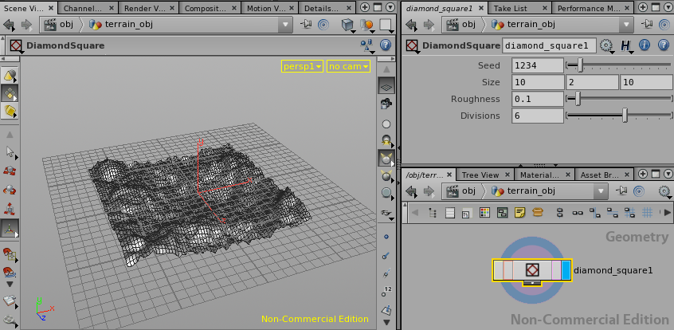

Diamond-Square Houdini SOP
==========================

This is a port of my [Diamond-Square 3ds Max plugin](https://github.com/sdao/DiamondSquare) to a Houdini SOP. See the original plugin's page for more details on the implementation (e.g. it wraps, it's iterative, etc.). This port is also [MIT-licensed](http://choosealicense.com/licenses/mit/) like the original.

To compile the SOP and install it to your local Houdini directories, run `make install` in the project directory from within the Houdini Shell environment. Note: the Makefile is configured to create a `dylib` for Mac OS X. If on Linux, change the Makefile to create a `so`; if on Windows, change the Makefile to create a `dll`.

To use the SOP, simply create an object in Houdini (such as a Box or a Sphere). Then go into the object and add the DiamondSquare SOP. Set the Display/Render flag on the new DiamondSquare SOP and delete the existing SOP.

Features
--------
* Configure randomness by setting the **Seed** parameter.
* Scale the terrain width/height/length by setting the **Size** parameter.
* Set the **Roughness** between 0 (none) and 1 (full). I suggest you limit this value to around 0.1 or 0.2.
* Set the **Divisions** parameter to change the number of iterations of the diamond-square algorithm. Note that this will exponentially increase the number of polygons in the terrain mesh.
* The Diamond-Square SOP will automatically add UV texture coordinates to its output geoemtry.

Screenshot
----------

